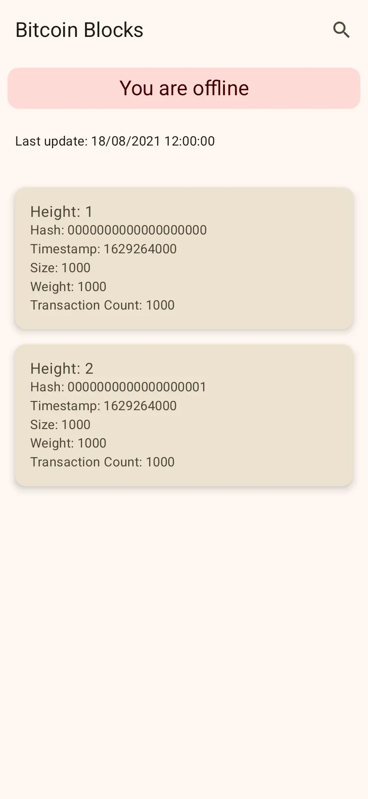
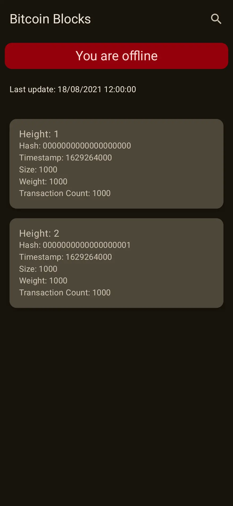

# Blocky

Blocky is an Android block explorer application built using Jetpack Compose. The app provides real-time updates on Bitcoin blocks, transactions, and addresses, optimized with multiple threads and caching for performance. 

---

## Features
1. **Real-Time Bitcoin Block Explorer**:
   - Lists recent Bitcoin blocks with details on transactions and related information.
2. **Transaction Viewer**:
   - Displays detailed information about transactions, including addresses involved, total fees, etc.
   - Allows fetching data for multiple transactions in parallel.
3. **Address Tracker**:
   - Enables users to track any Bitcoin address with a shortcut on the home screen.
   - Shows real-time balance updates in both BTC and USD.
4. **Mempool Monitoring**:
   - Displays a live feed of the latest transactions entering the mempool.
---

## Development Checklist

### Tasks
#### Core Development
- [X] **Setup Project**: Initialize an Android project with Jetpack Compose.
- [ ] **API Integration**:
  - [X] Integrate the [Mempool.space API](https://mempool.space/docs/api).
  - [ ] Integrate the [Bitfinex API](https://docs.bitfinex.com/docs).
- [ ] **Home Screen**:
  - [X] Display a list of recent Bitcoin blocks in real time.
  - [ ] Add a search shortcut to track specific Bitcoin addresses.
- [ ] **Block Details**:
  - [ ] Fetch and display block details (e.g., transactions, hash, size).
  - [ ] Show transactions related to the block with parallel fetching.
- [ ] **Address Tracker**:
  - [ ] Allow users to track Bitcoin addresses.
  - [ ] Display real-time balance in BTC and USD.
- [ ] **Transaction Viewer**:
  - [ ] Fetch and display detailed transaction data.
  - [ ] Include total fees and all involved addresses.
- [ ] **Mempool Transactions**:
  - [ ] Show live feed of the latest transactions entering the mempool.


### CI/CD
- [X] Automate unit tests
- [ ] Automate integration tests
- [ ] Automate the generation of release notes.
- [ ] Automate deployment to Google Play Store.
- [ ] Publish a linkedin post with the release notes.

#### Unit Testing
- [ ] Write unit tests for:
  - [ ] API integrations.
  - [X] Data fetching and caching.
  - [X] Real-time updates and UI components.

### Possible Improvements
- [ ] Implement [Floresta](https://github.com/vinteumorg/Floresta/blob/master/crates%2Ffloresta-cli%2FREADME.md#loaddescriptor) to run a local node in the phone
- [ ] Instant app module
- [ ] Wear OS module
- [ ] VR module
- [ ] Implement KMP

---
## Screenshots

The app supports both light and dark themes.

<div style="display: flex; gap: 20px;">
  
  
</div>

---

## Installation
1. Clone the repository:
   ```bash
   git clone https://github.com/jvsena42/blocky.git
